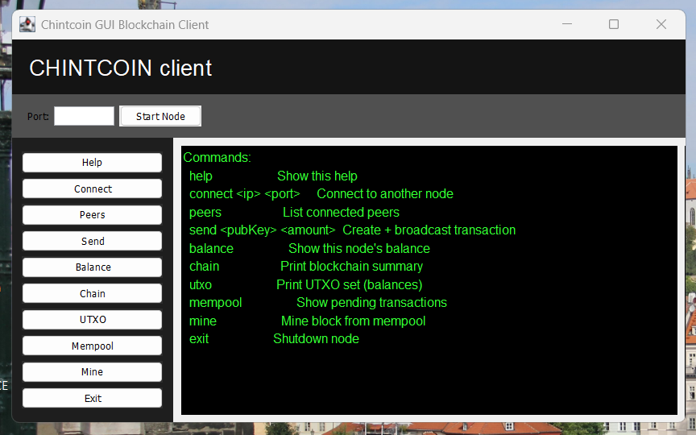

# CryptoCoin
This is my own **Blockchain** and **Cryptocurrency**.

## How to Run
**For now**, compile all .java files and run main using these commands:
 - `javac Block.java Blockchain.java GenesisUtil.java HashUtil.java Main.java Message.java Node.java Peer.java SerializationUtil.java Transaction.java TransactionInput.java TransactionOutput.java`
 - `java Main <port>`

**OR** run it using the new client GUI by compiling all files using:
 - `javac *.java`
 - `java GUIMain.java`

and select the port using the built-in peer-to-peer service by clicking *Connect*

## How it works
This project runs a simple peer-to-peer blockchain where each node maintains its own wallet, mines blocks, and exchanges transactions with peers. Each node runs independently on its own port and communicates with other nodes using a lightweight socket-based network.

To start a node, run:
`java Main <port>`

For example:
`java Main 5000`

When the node starts, it generates a public/private key pair, loads the blockchain from disk if one exists (or creates a new one), and begins listening for peer connections. The node prints its public key to the console — this key acts as the node’s wallet address and is required for receiving transactions.

Nodes can be connected together to form a network using the connect command:
`connect <ip> <port>`

Once connected, nodes automatically exchange blocks and transactions and will synchronize their chains if needed. You can view the list of connected peers at any time using:
`peers`

Mining is how new blocks are created and how new coins enter the system. To mine a block, run:
`mine`

Mining always includes a coinbase transaction that rewards the miner, even if there are no pending transactions in the mempool. Blocks can therefore be mined at any time. After mining, the blockchain grows by one block and the miner receives the block reward as a new unspent output. You can inspect the current blockchain with:
`chain`

To check your current balance, use:
`balance`

Balances are not stored directly but are derived from the UTXO set, which represents all unspent transaction outputs owned by a given public key. To inspect the full UTXO set for debugging or learning purposes, use:
`utxo`

Transactions allow coins to be transferred between nodes. To send coins, the sending node must already have mined or received funds, and it must know the recipient’s public key. Transactions are created using:
`send <recipientPublicKey> <amount>`

When a transaction is created, the node selects enough of its own unspent outputs to cover the amount, creates inputs referencing those outputs, generates outputs for the recipient and any change back to itself, signs the transaction with its private key, and adds it to the mempool. The transaction is broadcast to peers but is not considered final until it is mined into a block.

Pending (unconfirmed) transactions can be viewed using:
`mempool`

The mempool temporarily holds transactions before they are mined and also prevents local double-spending by ensuring the same UTXO cannot be referenced twice at the same time. The mempool is cleared when transactions are confirmed in a block or when a chain reorganization occurs.

Because nodes mine independently, forks can naturally occur. When this happens, nodes automatically resolve forks by adopting the longest valid chain. If a node switches to a different chain, it rebuilds its UTXO state and clears its mempool to ensure consistency. When this occurs, the message “Chain reorganized” may be printed — this is expected behavior.
Each node persists its blockchain state to disk using a file named:
`blockchain_<port>.dat`

When a node is restarted, the blockchain is loaded from disk and the UTXO set is rebuilt from block history, ensuring that balances and state remain correct across restarts.
To shut down a node cleanly, use:
`exit`

This notifies connected peers and terminates the process safely.

Overall, the CLI allows you to run multiple nodes, connect them into a peer-to-peer network, mine blocks, send and receive transactions, inspect balances and UTXOs, observe forks and reorganizations, and restart nodes without losing state. This project is designed for learning and experimentation, and inspecting internal state through the CLI is encouraged.